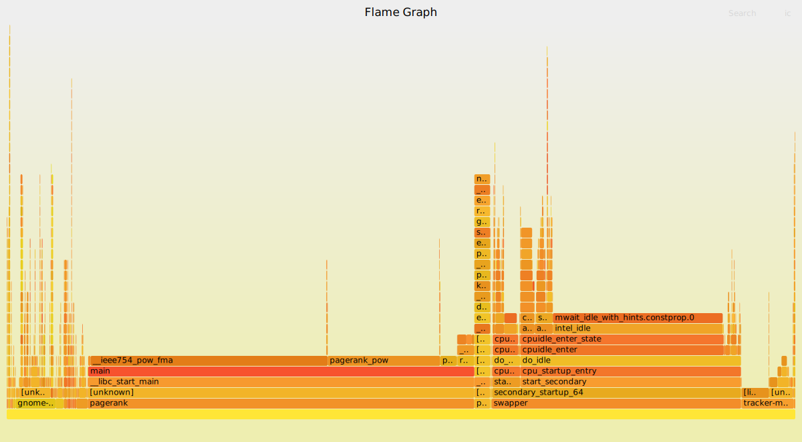
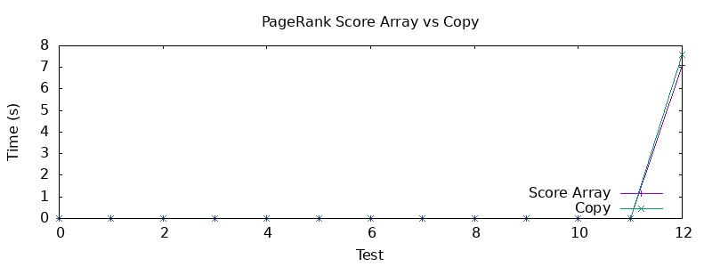
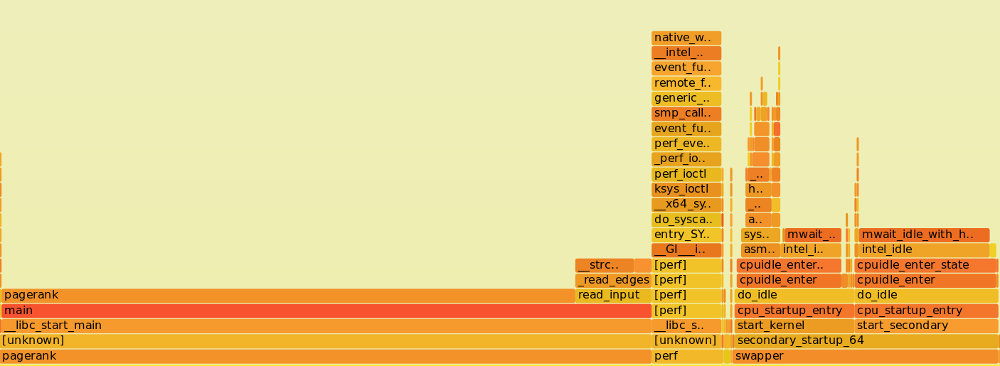
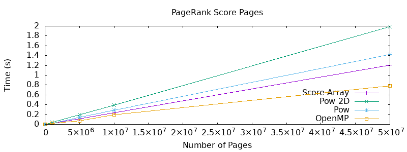

# PageRank Algorithm

## Installation

```
1. Clone this repository
2. make pagerank
3. ./pagerank
```

### Running Perf, Benchmark & Validity

In order to run perf tests (outputted to `out`), timing and validity tests type:

```
1. ./test.sh
```

## Description

**NOTE: All versions of the pagerank methods can be found in `pagerank.c` just modify their names or the method being called in `main`.**

The data structure used for the implementation of the PageRank algorithm was a simple `struct`:

```c
/**
   * The struct to store the page and its score
   */
struct page_score {
    double score[2];
    page* page;
};
```

Each would store an array of the scores rather than having a separate `previous` and `new_score` value for each struct. Alternatively (as discussed in [Score Array and Unnecessary Copying](#Score Array and Unnecessary Copying)), a score array was not the first approach but rather using two variables to store the old and new value with a copy after every iteration.

*Previous Struct*

```c
struct page_score_2D {
    double new_score;
    double old_score;
    page* page;
};
```


Furthermore each `page_score` struct would be initialised to hold the page of list in sequential order such that their indices correspond to the index in the `struct page`.

```c
/**
   * Initialise the values of the struct array of page scores
   * @param plist, the list of pages
   * @param npages, the number of pages
   * @return the array of page score structs
   */
struct page_score* init_pageranks(list* plist, int npages) {
    struct page_score* page_scores = malloc(sizeof(struct page_score) * np  ages);
    register double initial_value = 1/(double)(npages);
    node* current = plist->head;
    for (size_t i = 0; i < npages; i++) {
        page_scores[i].page = current->page;
        page_scores[i].score[0] = initial_value;
        page_scores[i].score[1] = initial_value;
        current = current->next;
    }
    return page_scores;
}

```

Hence, through this there was a way to hold the score at each iteration for each page without having to modify the provided node or page structs and without having to do an unnecessary search every time.

Afterwards the sequential implementation just required to loop until convergence. Within the loop every `page_score` is changed givens its page `inlinks` and `outlinks`.

```c
// Loop through until the convergence threshold is reached
while (diff > EPSILON) {
    diff = 0.0;
    for (size_t i = 0; i < npages; i++) {
        page_scores[i].score[x] = dampening_value;
        register double total = 0.0;

        // Get the list of pages that inlink to this page
        list* inlist = page_scores[i].page->inlinks;

        // If null then add diffrerence and continue looping
        if (inlist == NULL || current->page->noutlinks == 0) {
            diff += pow(page_scores[i].score[x] - page_scores[i].score[!x], 2);;
            continue;
        }
        // Get the node to loop
        node* current = inlist->head;

        // Loop through the list
        while (current != NULL) {
            total += (page_scores[current->page->index].score[!x]) / ((double)current->page->noutlinks);
            current = current->next;
        }
        page_scores[i].score[x] += total * dampener; // Update the new score
        diff += pow(page_scores[i].score[x] - page_scores[i].score[!x], 2);
    }
    x = (x + 1) % 2;        // Update the value so we do not have to copy
    diff = sqrt(diff);      // Get the total difference
}
```


## Implementation and Benchmarks

### Score Array and Unnecessary Copying

Based on the previous part of the assignment it was decided that using some knowledge gained off a 3D array was useful in this scenario. Rather than having a copy loop which would copy all previous values of the iteration to the next.

```c
for (size_t i = 0; i < npages; i++) {
    page_scores[i].prev = page_scores[i].current;
}
```

Instead the `struct page_score` would contain a `double[2]` array and would alternate between 1 and 0 after each iteration.

```c
for (size_t i = 0; i < npages; i++) {
    page_scores[i].score[x] = dampening_value;
    
    // CODE BELOW - removed for this example

    while (current != NULL) {
        total += (page_scores[current->page->index].score[!x]) / ((double)current->page->noutlinks  );
        current = current->next;
    }
    
    page_scores[i].score[x] += total * dampener; // Update the new score
    diff += (page_scores[i].score[x] - page_scores[i].score[!x]) * (page_scores[i].score[x] - page_sco  res[i].score[!x]);
}

x = (x + 1) % 2;        // Update the value so we do not have to copy

```


Specifically there would have had to have been something like this:

```c
for (size_t i = 0; i < npages; i++) {
    page_scores[i].old_score = page_scores[i].new_score;
}
```

These resulted in significantly longer runtimes:

```c
-------------------- TIME TESTS --------------------
Test: sample.in

real	0m0.001s
user	0m0.001s
sys		0m0.000s
Test: test01.in

real	0m0.001s
user	0m0.000s
sys		0m0.001s
Test: test02.in

real	0m0.001s
user	0m0.001s
sys		0m0.000s
Test: test03.in

real	0m0.001s
user	0m0.000s
sys		0m0.000s
Test: test04.in

real	0m0.001s
user	0m0.001s
sys		0m0.000s
Test: test05.in

real	0m0.001s
user	0m0.000s
sys		0m0.001s
Test: test06.in

real	0m0.001s
user	0m0.001s
sys		0m0.000s
Test: test07.in

real	0m0.001s
user	0m0.001s
sys		0m0.000s
Test: test08.in

real	0m0.001s
user	0m0.000s
sys		0m0.001s
Test: test09.in

real	0m0.001s
user	0m0.000s
sys		0m0.001s
Test: test10.in

real	0m0.001s
user	0m0.001s
sys		0m0.000s
Test: test11.in

real	0m0.001s
user	0m0.000s
sys		0m0.001s
Test: test12.in

real	0m8.163s
user	0m8.152s
sys		0m0.002s
```

Specifically for `test12.in` it resulted in a run-time greater than 0.4 seconds when compared to the exact same method but using a score array as described above.

```c
Test    Time
sample  0.000010
test1   0.000008
test2   0.000003
test3   0.000004
test4   0.000003
test5   0.000004
test6   0.000004
test7	0.000003
test8	0.000008
test9 	0.000010
test10  0.000042
test11	0.000042
test12  7.895575
```

And using `omp_get_wtime()` the total difference is significant between the two implementations (see below).


### Score Array and `pow` Runtime

```c
-------------------- TIME TESTS --------------------
Test: sample.in
real	0m0.001s
user	0m0.000s
sys		0m0.001s

Test: test01.in
real	0m0.001s
user	0m0.000s
sys		0m0.001s

Test: test02.in
real	0m0.001s
user	0m0.001s
sys		0m0.000s

Test: test03.in
real	0m0.001s
user	0m0.000s
sys		0m0.001s

Test: test04.in
real	0m0.001s
user	0m0.000s
sys		0m0.001s

Test: test05.in
real	0m0.001s
user	0m0.001s
sys		0m0.000s

Test: test06.in
real	0m0.001s
user	0m0.000s
sys		0m0.001s

Test: test07.in
real	0m0.001s
user	0m0.000s
sys		0m0.001s

Test: test08.in
real	0m0.001s
user	0m0.001s
sys		0m0.000s

Test: test09.in
real	0m0.001s
user	0m0.001s
sys		0m0.000s

Test: test10.in
real	0m0.001s
user	0m0.001s
sys		0m0.000s

Test: test11.in
real	0m0.001s
user	0m0.000s
sys		0m0.001s

Test: test12.in
real	0m7.766s
user	0m7.739s
sys		0m0.001s
```


When performing a previous project, it came across that a considerable amount of time was being spent in certain library calls, one of them being `pow`. In this case I attempted to discover if there was any impact here. As we can see from the Flame Graph there is a considerable amount of time spent calling the `pow` function and hence it was much more efficient to manually power by multiplying the two values together.



The tests were run by modifying main to get a more accurate result:

```c
/* run pagerank and output the results */
double start = omp_get_wtime();
pagerank(plist, ncores, npages, nedges, dampener);
double end = omp_get_wtime();
printf("%lf\n", (end - start));
```

Using the `omp_get_wtime()` results:

```c
Test		Time
sample		0.000008
test1    	0.000008
test2    	0.000005
test3    	0.000006
test4    	0.000004
test5    	0.000003
test6    	0.000007
test7    	0.000006
test8    	0.000008
test9    	0.000011
test10   	0.000058
test11	    0.000057
test12		6.924148
```

#### Comparison With Unnecessary Copying

Below the graph details the differences in run-time between an additional copy and the score array optimisation:




### Without `pow` Runtime

Due to the issues of `pow` above it was decided to eliminate this and rather multiply as such:

```c
if (inlist == NULL) {
    diff += (page_scores[i].score[x] - page_scores[i].score[!x]) * (page_scores[i].score[x]   - page_scores[i].score[!x]);
    continue;
}

// Rather than
    diff += pow(page_scores[i].score[x] - page_scores[i].score[!x], 2);
```

The following times are listed below:

```
-------------------- TIME TESTS --------------------
Test: sample.in
real	0m0.001s
user	0m0.001s
sys		0m0.000s

Test: test01.in
real	0m0.001s
user	0m0.001s
sys		0m0.000s

Test: test02.in
real	0m0.001s
user	0m0.000s
sys		0m0.000s

Test: test03.in
real	0m0.001s
user	0m0.001s
sys		0m0.000s

Test: test04.in
real	0m0.001s
user	0m0.000s
sys		0m0.000s

Test: test05.in
real	0m0.001s
user	0m0.000s
sys		0m0.000s

Test: test06.in
real	0m0.001s
user	0m0.000s
sys		0m0.001s

Test: test07.in
real	0m0.001s
user	0m0.000s
sys		0m0.000s

Test: test08.in
real	0m0.001s
user	0m0.000s
sys		0m0.001s

Test: test09.in
real	0m0.001s
user	0m0.001s
sys		0m0.000s

Test: test10.in
real	0m0.001s
user	0m0.001s
sys		0m0.000s

Test: test11.in
real	0m0.001s
user	0m0.001s
sys		0m0.000s

Test: test12.in
real	0m3.069s
user	0m3.064s
sys		0m0.001s
```

After modifying the `pow` and using a simple multiplication we see a huge reduction in the time.



The times using `omp_get_wtime()` gave:

```c
Dimensions		Time
sample			0.000001
test1		    0.000001
test2			0.000001
test3 			0.000001
test4			0.000001
test5			0.000001
test6 			0.000001
test7			0.000001
test8			0.000002
test9			0.000002
test10			0.000014
test11			0.000014
test12          2.685944
```


### Loop Unrolling

As an extension in an attempt to optimise the loop overhead, loop unrolling was used on the inner loop:

```c
for (; i <= npages - 4; i += 4) {
    page_scores[i].score[x] = dampening_value;
    diff += update_score(page_scores, &page_scores[i], dampener, x);

    page_scores[i + 1].score[x] = dampening_value;
    diff += update_score(page_scores, &page_scores[i + 1], dampener, x);

    page_scores[i + 2].score[x] = dampening_value;
    diff += update_score(page_scores, &page_scores[i + 2], dampener, x);

    page_scores[i + 3].score[x] = dampening_value;
    diff += update_score(page_scores, &page_scores[i + 3], dampener, x);
}

for (; i < npages; i++) {
    page_scores[i].score[x] = dampening_value;
    diff += update_score(page_scores, &page_scores[i], dampener, x);
}
```

Although this seemed as if it would provide major performance improvements it only seemed to decrease performance by approximately `0.6` seconds.

```c
Test		Time
sample		0.000001
1           0.000001
2           0.000000
3           0.000000
4           0.000000
5           0.000000
6           0.000000
7           0.000000
8           0.000001
9           0.000001
10          0.000021
11          0.000015
12          3.346047
```

This increase in time could possibly be due to the fact that we were making multiple function calls compared to the previous implementation which just performed the whole operation inside the `pagerank` function. Moreover since we are technically increasing the amount of code there is a significant amount of increased usage of the register which contributes to the reduction in performance. Just unrolling the `print` statement after provides no huge benefit as well achieving a time of only `2.727` seconds.


### OpenMP Thread Runtime

```c
-------------------- TIME TESTS --------------------
Test: sample.in

real	0m0.001s
user	0m0.000s
sys		0m0.001s
Test: test01.in

real	0m0.001s
user	0m0.001s
sys		0m0.000s
Test: test02.in

real	0m0.001s
user	0m0.000s
sys		0m0.001s
Test: test03.in

real	0m0.001s
user	0m0.001s
sys		0m0.000s
Test: test04.in

real	0m0.001s
user	0m0.000s
sys		0m0.001s
Test: test05.in

real	0m0.001s
user	0m0.001s
sys		0m0.000s
Test: test06.in

real	0m0.001s
user	0m0.000s
sys		0m0.001s
Test: test07.in

real	0m0.001s
user	0m0.000s
sys		0m0.001s
Test: test08.in

real	0m0.001s
user	0m0.000s
sys		0m0.003s
Test: test09.in

real	0m0.001s
user	0m0.000s
sys		0m0.001s
Test: test10.in

real	0m0.001s
user	0m0.001s
sys		0m0.000s
Test: test11.in

real	0m0.002s
user	0m0.003s
sys		0m0.003s
Test: test12-1.in

real	0m19.969s
user	0m19.910s
sys		0m0.014s
Test: test12-2.in

real	0m16.194s
user	0m31.585s
sys		0m0.051s
Test: test12-8.in

real	0m20.139s
user	2m30.563s
sys		0m0.111s
Test: test12.in

real	0m14.317s
user	0m55.286s
sys		0m0.084s
```

The parallel implementation made use of threading the main for loop. What is interesting to note is that a static scheduling seemed like the most efficient approach as the work would easily be divided amongst the threads:

`#pragma omp parallel for schedule(static)`

But the idea here is a bit tricky, since the **difference** value is being changed hence the update to difference needs to be extracted. 

```c
#pragma omp parallel for private(i)
for (i = 0; i < npages; i++) {
    page_scores[i].score[x] = dampening_value;
    register double total = 0.0;

    // Get the list of pages that inlink to this page
    list* inlist = page_scores[i].page->inlinks;

    // If null then add diffrerence and continue looping
    if (inlist == NULL) {
        continue;
    }
    // Get the node to loop
    node* current = inlist->head;
    // Loop through the list
    while (current != NULL) {
        total += (page_scores[current->page->index].score[!x]) / ((double)current->page->  noutlinks);
        current = current->next;
    }

    page_scores[i].score[x] += total * dampener; // Update the new score
}
```

As shown above the difference update is removed into a separate for loop such that there isn't a race condition and eliminates the need for an `atomic` or `critical` section of the for loop as such:

```c
#pragma omp atomic update
diff += ...
```


The following times were achieved for a `default` scheduling:

```c
Test    Time
sample  0.000013
1    	0.000013
2    	0.000001
3    	0.000001
4    	0.000001
5    	0.000018
6    	0.000016
7    	0.000016
8    	0.068941
9    	0.000003
10    	0.000026
11   	0.230591
12-1    3.385419
12-2    2.316247
12-4    2.099469
12-8    1.864362
```

But still these times are nowhere near expected for a parallel optimisation of the pagerank algorithm. 

#### Pragma Critical Around Difference Sum

Attempting a `pragma omp critical` in a single for loop gives excessively higher runtimes as we can expect multiple threads to be conflicting in contention for this line:

```c
#pragma omp critical
diff = diff + page_scores[i].difference;
```

The times below show the inefficiency of a `pragma omp critical` directive in this scenario:

```c
Test	Time
sample	0.000015
1    	0.000016
2    	0.000001
3    	0.000001
4  	  	0.000001
5  	    0.000017
6	    0.000015
7  		0.000018
8    	0.000032
9    	0.000002
10    	0.000024
11    	0.000153
12-1    5.359157
12-2    13.226314
12-4    23.349664
12-8    41.443465
```


#### Pragma Atomic

Since the `pragma omp critical` directive was so time consuming then a more efficient atomic operation was decided upon since the time of contention would be quite small. This means that a **busy-waiting** approach rather than suspending the thread would be much more useful in this scenario:

```c
#pragma omp atomic write
diff = diff + page_scores[i].difference;
```


The results were better than with `critical` yet still not sufficient enough for a parallel solution. But as the number of threads increase to 8 we see an insane projection:

```c
Test		Time
sample.in	0.000014
test01.in	0.000014
test02.in	0.000001
test03.in	0.000001
test04.in	0.000001
test05.in	0.000019
test06.in	0.000012
test07.in	0.000013
test08.in	0.066317
test09.in	0.000003
test10.in	0.000024
test11.in	0.461696
test12-1.in	4.138385
test12-2.in	8.020848
test12-4.in	19.682065
test12-8.in	76.166786
```


#### Padding Struct

Since some of the issues with time would have been to do with false sharing, the struct was padded to be a total of 64 bytes such that it fits into a cache line directly.

```c
-------------------- TIME TESTS --------------------
sample.in	0.000015
test01.in	0.000020
test02.in	0.000001
test03.in	0.000001
test04.in	0.000001
test05.in	0.000017
test06.in	0.000018
test07.in	0.000018
test08.in	0.000030
test09.in	0.000002
test10.in	0.000028
test11.in	0.000067
test12-1.in	3.062184
test12-2.in	1.774298
test12-8.in	1.606186
test12.in	1.704996

```


#### Reduction on Difference Sum

Instead a reduction on the sum of differences was chosen to help optimise the second for loop:

```c
#pragma omp parallel for reduction (+:diff)
for (i = 0; i < npages; i++) {
    diff = diff + page_scores[i].difference;
}
```

The results with this reduction are very surprising with a consistent decrease every time.

```c
0.000015
0.000015
0.000001
0.000001
0.000001
0.000017
0.000020
0.000015
0.000027
0.000003
0.000025
0.000065
3.374477
2.002390
1.850901
1.571700
```


#### Static (Reduction)

With chunk sizes of 2, 4 and 8 we have:

**Chunk Size = 2**

```c
-------------------- TIME TESTS --------------------
sample.in	0.000004
test01.in	0.000004
test02.in	0.000001
test03.in	0.000001
test04.in	0.000000
test05.in	0.000001
test06.in	0.000004
test07.in	0.000004
test08.in	0.000007
test09.in	0.000002
test10.in	0.000021
test11.in	0.000048
test12-1.in	3.178239
test12-2.in	3.051578
test12-8.in	2.711370
test12.in	2.639630

```


**Chunk Size = 4**

```c
-------------------- TIME TESTS --------------------
sample.in	0.000003
test01.in	0.000004
test02.in	0.000001
test03.in	0.000001
test04.in	0.000000
test05.in	0.000001
test06.in	0.000004
test07.in	0.000005
test08.in	0.000007
test09.in	0.000002
test10.in	0.000019
test11.in	0.000046
test12-1.in	3.309710
test12-2.in	3.019476
test12-8.in	2.212091
test12.in	2.483555
```


**Chunk Size = 8**

```c
0.000033
0.000034
0.000029
0.000027
0.000028
0.000037
0.000026
0.000024
0.000027
0.000023
0.000076
0.000951
0.147611
0.000360
0.000318
0.000345
```


#### Dynamic (Reduction)

With the dynamic tests we get a very interesting predicament.

From the data below it seemed as if false sharing was occurring in the loop as we have a sufficiently increased time when using dynamic with a chunk size for 2, 4 and 8 threads. Modifying the chunk sizes to 2, 4, and 8 are shown below:

**Chunk Size = 2**

```c
-------------------- TIME TESTS --------------------
sample.in	0.000007
test01.in	0.000006
test02.in	0.000001
test03.in	0.000001
test04.in	0.000001
test05.in	0.000002
test06.in	0.000003
test07.in	0.000003
test08.in	0.157384
test09.in	0.000003
test10.in	0.000049
test11.in	0.000090
test12-1.in	6.832125
test12-2.in	10.849397
test12-8.in	8.730513
test12.in	12.916811
```

**Chunk Size = 4**

```c
-------------------- TIME TESTS --------------------
sample.in	0.000006
test01.in	0.000007
test02.in	0.000001
test03.in	0.000001
test04.in	0.000001
test05.in	0.000002
test06.in	0.000003
test07.in	0.000003
test08.in	0.146991
test09.in	0.000003
test10.in	0.000048
test11.in	0.000085
test12-1.in	6.833124
test12-2.in	11.300713
test12-8.in	8.779134
test12.in	12.723585
```


**Chunk Size = 8**

However for 8 chunks the results show that there are fewer instances of false sharing:

```c
-------------------- TIME TESTS --------------------
sample.in	0.000006
test01.in	0.000006
test02.in	0.000001
test03.in	0.000001
test04.in	0.000001
test05.in	0.000002
test06.in	0.000003
test07.in	0.000003
test08.in	0.131622
test09.in	0.000003
test10.in	0.000025
test11.in	0.000061
test12-1.in	3.773181
test12-2.in	3.216287
test12-8.in	2.219597
test12.in	3.090391
```


## Comparison On Number of Pages

As an extension, the methods were run against inputs wherein the number of pages would vary from 100 - 50000000.




